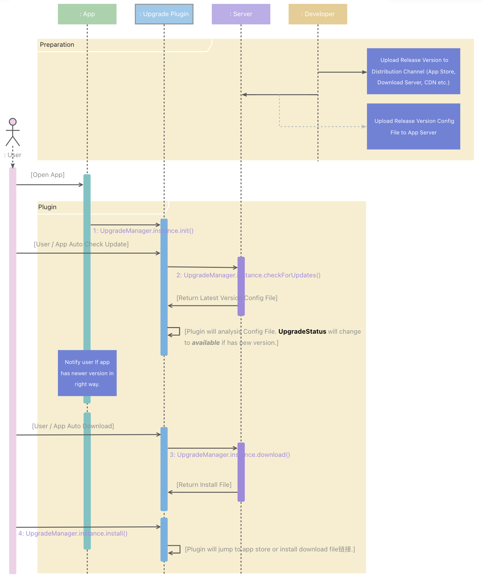

# In App Upgrade

A Flutter plugin for prompting and help users to upgrade when there is a newer version of this app in the app store or server repository.

## <font color=red>⚠ Disclaimer</font>
This is an developing plugin. The plugin's API maybe has breaking changes. Please use with caution or continuous attention updates.

## Contents
- [Overview](#overview)
- [Platform Support](#platform-support)
- [How it work?](#how-it-work)
- [Getting Started](#getting-started)
- [Basic Concepts](#basic-concepts)
- [Custom View](#custom-view)
- [Core API Reference](#core-api-reference)
- [License](#license)

## Overview

This plugin has the following functions:
- Check for whether has a newer app version
- When a newer app version is available in the app store, notify user to update.
- When a newer app version is available in custom app version management server, download and install it.

With today's modern app stores, there is little need to persuade users to upgrade because most are already using the auto upgrade feature. However, there may be times when an app needs to be updated more quickly than usual, and nagging a user to upgrade will entice the upgrade sooner.

Also, Flutter supported more than just Android and iOS platforms that doesn't has the dominant app store, like macOS, linux and windows, need to handle distribution and upgrade ourselves.

## Platform Support

|Platform|Open App Store|Download/Install Installer|Third-party App Store|
|:---:|---|---|---|
|iOS|✅Yes|❌No||
|android|✅Yes|✅Yes|Google Play, 酷安, 应用宝, 百度手机助手, 360手机助手, 豌豆荚|
|macOS|✅Yes|✅Yes||
|linux|❌No|✅Yes||
|windows|❌No|✅Yes||

## How it work?



## Getting Started

### 0. Preparation

You should supply a server that offer [App Version Config File](#appcast) lookup and install files download services.

Example server at [Upgrade Server](https://github.com/Flutter-Chore/Flutter-InAppUpgrade-Local-Server).

### 1. Installing

add this code in `pubspec.yaml`

```yaml
dependencies:
  ...
  upgrade: last version
```

### 2. Config Before Use

#### Android

1. Create `file_provider_path.xml` at `android/app/src/main/res/xml`, and add below content:
```xml
<?xml version="1.0" encoding="utf-8"?>
<paths>
    <files-path name="files" path="." />
    <cache-path name="cache" path="." />
    <external-path name="external" path="." />
    <external-cache-path name="cache" path="." />
    <external-files-path name="files" path="." />
</paths>
```
2. Add below attributes in `android/app/src/main/AndroidManifest.xml`
```xml
<manifest xmlns:android="http://schemas.android.com/apk/res/android" package="your.package">
    <!--other attributes-->

    <!--(if you want to upload google store,can not add this permission)-->
    <uses-permission android:name="android.permission.REQUEST_INSTALL_PACKAGES" />
    <uses-permission android:name="android.permission.INTERNET" />
    <uses-permission android:name="android.permission.READ_EXTERNAL_STORAGE" />

    <application>
        <!--other attributes-->
        <provider
            android:authorities="${applicationId}.fileProvider"
            android:name="androidx.core.content.FileProvider"
            android:exported="false"
            android:grantUriPermissions="true">
            <meta-data
                android:name="android.support.FILE_PROVIDER_PATHS"
                android:resource="@xml/file_provider_path"/>
        </provider>
    </application>
</manifest>
```

#### MacOS

You should set below attributes in *.entitlements
```xml
<dict>
    <!--other attributes-->
    <key>com.apple.security.network.client</key>
    <true/>
    <key>com.apple.security.files.downloads.read-write</key>
    <true/>
</dict>
```

### 3. Create [Version Config File](#appcast) at local to mark current app's version.

Example at [AppcastItem](#appcastitem).

### 4. Init plugin in suitable places.

```dart
void main() {
    UpgradeManager.instance.init(
        url: '', // upgrade server url
        currentVersionPath: '', 
    );

    runApp(const MyApp());
}
```

### 5. Download if need and install.

how to use? see [UpgradeManager](#upgrademanager)
```dart
// Download if need
UpgradeManager.instance.download()

// Install
UpgradeManager.instance.install()
```


## Basic Concepts

### Appcast

(**⚠️ If incorrently profile or lack config file, the plugin will not work.**)

An Array of [AppcastItem](#appcastitem). will select the best one as the latest version.

#### AppcastItem
|Name|Type|Description|
|---|---|---|
|release_notes|dynamic|Any types, all data will pass to [CustomUpgradeDialog](#2-customupgradedialog) completely.|
|date|DateTime?|The appcast's release date.|
|version|String \| Object|The semantic Versioning spec at [https://semver.org/](https://semver.org/), must be a string same with the spec or an object like [Version Object](#additional-version-object) |
|display_version_string|String?|Custom display version string, If you don't like version' string|
|os|ios \| android \| macos \| linux \| windows|Enum, must one of ios \| android \| macos \| linux \| windows, the appcast only used in the os|
|minimum_system_version|String?|*Not implementation yet*|
|maximum_system_version|String?|*Not implementation yet*|
|installers|Array<Map<String, dynamic>>|The appcast's installers. Execute in sequence, one execution fails to select the next, see [Installer](#installer)|

Appcast config file example as below:
```json
/// version.json
[
  {
    "name": "Flutter-InAppUpgrade",
    "description": "this is Flutter-InAppUpgrade local example app",
    "release_notes": "\n1. \n2. \n3.",
    "version": "0.3.1-beta+20130313144700",
    "os": "macos",
    "installers": [{
      "initializer": "macos_app_store",
      "app_id": "1233593954"
    }, {
      "initializer": "file",
      "file_url": "http://localhost:8000/download/flutter-inappupgrade-v0.3.2-beta.dmg"
    }]
  },
  {
    "name": "Flutter-InAppUpgrade",
    "description": "this is Flutter-InAppUpgrade local example app",
    "release_notes": "\n1. \n2. \n3.",
    "version": "0.3.1-beta+20130313144700",
    "os": "ios",
    "installers": [{
      "initializer": "ios_app_store",
      "app_id": "",
      "in_app": false
    }]
  },
  {
    "name": "Flutter-InAppUpgrade",
    "description": "this is Flutter-InAppUpgrade local example app",
    "release_notes": "\n1. \n2. \n3.",
    "version": "0.3.1-beta+20130313144700",
    "os": "android",
    "installers": [{
      "initializer": "android_app_market",
      "market": "official"
    }]
  }
]
```

##### Additional: Version Object
**major, minor, patch at least one must be greater than 0**
|Name|||
|---|---|---|
|major|required|Int, greater than 0|
|minor|required|Int, greater than 0|
|patch|required|Int, greater than 0|
|pre_release|optional|Array<String>, and each item may only contain [0-9A-Za-z-]|
|build|optional|String, must contain only [0-9A-Za-z-.]|

### UpgradeStatus

Plugin's state, will auto update when state changes.

|Name|Description|
|:--|---|
|loadingLocalConfig|Plugin's state will be `loadingLocalConfig` when `init()` load local version config file|
|idle|Plugin's state will be `idle` when `init()` finished, `Initial` state|
|checking|Plugin's state will be `checking` when calling `checkForUpdates()`|
|available|Plugin's state will be `available` when has newer version after `checkForUpdates()`|
|upToDate|Plugin's state will be `upToDate` when no newer version after `checkForUpdates()`|
|downloading|Plugin's state will be `downloading` when downloading install file|
|readyToInstall|Plugin's state will be `readToInstall` when downloaded install file|
|installing|Plugin's state will be `installing` when install download file or open app store|
|error|Plugin's state will be `error` when catch error|
|dismissed|Plugin's state will be `dismissed` when call `dismiss()`|

### Installer

[Appcast's](#appcast) installer, specifies how to install update.

#### System Installers

##### 1. file installer

Download install file and install it.

```json
{
    "identifier": "file",        // must
    "file_url": "",              // parameter, where to download
    "close_on_installing": true, // parameter, default is true, If if ture, will close app when installing.
}
```

##### 2. android apk installer

Download android apk and install it. 

**Don't use [file installer](#1-file-installer), it does not work because of system limitations.**

```json
{
    "identifier": "android_apk", // must
    "file_url": "",              // parameter, where to download
}
```

##### 3. android app market installer

open android app market.

```json
{
    "identifier": "android_app_market",        // must
    "market": "official | google_play | cool | tencent | baidu | 360 | wandoujia", // enum, app market
}
```

##### 4. ios app store installer

open ios app store.

```json
{
    "identifier": "ios_app_store",   // must
    "app_id": "",                    // parameter, app id
    "in_app": false,                 // parameter, default is false, If ture, will open app store in app.
}
```

##### 5. macos app store installer

open macos app store.

```json
{
    "identifier": "macos_app_store",  // must
    "app_id" "",                      // parameter, app id
}
```

#### Custom Installers

If system installers cannot meet your requirements. you can define your custom installer like below:

##### 1. Define custom install.

```dart
/// custom installer define file.
class CustomInstallerInitializer extends InstallInitializer {

    @override
    String get identifier => "custom installer identifer, unique";

    @override
    Installer init({
        required UpgradeStateChangeNotifier state,
        required Map<String, dynamic> data,
    }) {
        return CustomInstaller(
            state: state,
            param: data['param'],
        );
    }
}

class CustomInstaller extends Installer {

    var param;

    CustomInstaller({
        required super.state,
        required this.param,
    }) : super.init();

    @override
    bool hasDownload() => true;

    @override
    void download({
        String? url,
        File? file,
        void Function(int received, int total, bool failed)? onReceiveProgress,
        void Function()? onDone,
    }) async {
        /// How to download, can empty if has download is false.
    }

    @override
    Future<bool> install() async {
        /// How to install.
    }
}
```

##### 2. Register custom installer when plugin init.

```dart
UpgradeManager.instance.init({
    url: "",
    currentVersionPath: "",
    customInstallInitializers: const [
        CustomInstallerInitializer(),
    ],
})
```

## Custom View

If you want build some UI view rely on Upgrade state, you can use [CustomUpgradeView](#customupgradeview) widget.

### CustomUpgradeView

The widget will pass plugin's all state to you, and responsively.

```dart
Widget build(BuildContext context) {
    return CustomUpgradeView(
        builder: (context, state) {
            return Text("implement your widget");
        }
    );
}
```

There are two convenient widgets of [CustomUpgradeView](#customupgradeview):

### 1. CustomUpgradeStatusIndicator

The widget will pass [#UpgradeStatus](#upgradestatus) to you, it is convenient for you to create components that prompt the user for changes in upgrage state.

```dart
Widget build(BuildContext context) {
    return CustomUpgradeStatusIndicator(
        builder: (context, status) {
            return Text(status.toString());
        }
    );
}
```

### 2. CustomUpgradeDialog

The widget will pass latest [AppcastItem's](#appcastitem) releaseNotes, it is convenient for you to create dialog that prompt the user about what's update.

```dart
Widget build(BuildContext context) {
    return CustomUpgradeDialog(
        builder: (context, releaseNotes) {
            return Text(releaseNotes.toString());
        }
    );
}
```

## Core API Reference

### UpgradeManager

Plugin's core class, manage app's upgrade.

#### Member Variables

```dart
UpgradeStatus staus; 
```
Plugin's state, see [UpgradeStatus](#upgradestatus)

```dart
AppcastItem? current;
```
App's current version, see [Appcast](#appcast), [AppcastItem](#appcastitem).

```dart
AppcastItem? latest;
```
App's latest version, see [Appcast](#appcast), [AppcastItem](#appcastitem).


```dart
Installer? installer;
```
Current Installer.

#### Methods

```dart
void UpgradeManager.instance.init({
    required String url,
    required String currentVersionPath,
    List<InstallInitializer> customInstallInitializers = const [],
    bool crashIfNoLegalConfigFile = false,
  })
```

Init UpgradeManger.

##### Parameters
- url: A URL used to detect if there is a new version of the app.
- currentVersionPath: A config file path that mark current version, see [Appcast](#appcast), [Create Version Config File at Local](#3-create-version-config-file-at-local-to-mark-apps-current-version).
- customInstallInitializers: custom InstallInitializer, see [Custom Installers](#custom-installers).
- crashIfNoLegalConfigFile: Whether crash if no legal config file in local, default is false.

```dart
void UpgradeManager.instance.checkForUpdates()

```
Check for updates.

```dart
void UpgradeManager.instance.download({
    String? url,
    File? file,
    void Function(int received, int total, bool failed)? onReceiveProgress,
    void Function()? onDone,
})
```

Download install file, if has new version.

##### Parameters
- url: A URL to download install file. if null, it will try to download from [file installer's](#1-file-installer) `file_url`.
- file: Where the downloaded file is stored, If null, will store at Temporary Directory.
- onReceiveProgress: Download progress.
- onDone: call on download finish.

```dart
Future<bool> UpgradeManager.instance.install();
```
Install from current installer, will return install success or failure.

```dart
bool UpgradeManager.instance.nextInstaller();
```
If install failure, you can call `nextInstaller()` to change to next installer, and then call `install()` to install it.

## License

MIT